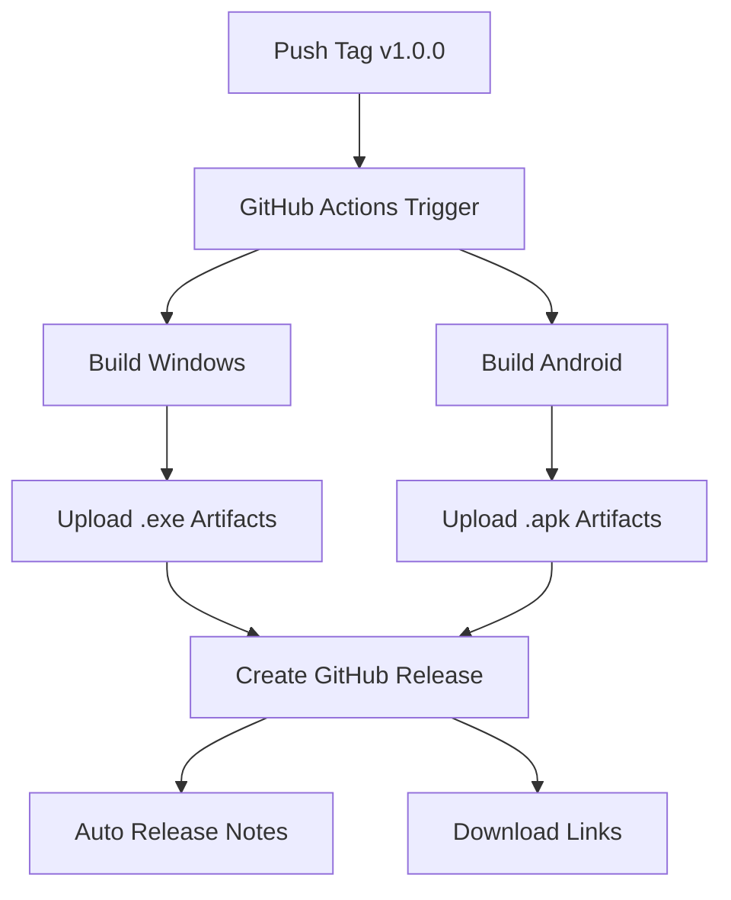

# 🚀 Guide de Déploiement GitHub Actions

Ce guide explique comment utiliser les GitHub Actions pour automatiser la compilation et le déploiement de SushiScan.

## 📋 Vue d'Ensemble

Le workflow GitHub Actions compile automatiquement :
- **🖥️ Application Windows** (.exe) via Electron Forge
- **📱 Application Android** (.apk) via Capacitor/Gradle

## 🎯 Déclencheurs

### Automatiques
- **Tags Version** : `git tag v1.0.0 && git push origin v1.0.0`
- **Push vers main** : Pour les builds de développement
- **Pull Requests** : Pour valider les changements

### Manuel
- Aller dans **Actions** > **🍣 Build & Deploy SushiScan** > **Run workflow**

## 🏗️ Processus de Build

### 🖥️ Windows (.exe)
```yaml
Environnement: windows-latest
Node.js: 18.x
Commandes:
  - npm ci
  - npm run make
Sortie: out/make/squirrel.windows/x64/*.exe
```

### 📱 Android (.apk)
```yaml
Environnement: ubuntu-latest
Node.js: 18.x
Java: 17
Android SDK: Dernière version
Commandes:
  - npm run build
  - npm run cap:sync
  - cd android && ./gradlew assembleRelease
Sortie: android/app/build/outputs/apk/release/*.apk
```

## 📥 Créer une Release

### 1. Préparer la Version
```bash
# Mettre à jour la version dans package.json
npm version patch  # ou minor/major

# Commiter les changements
git add .
git commit -m "🎉 Bump version to v1.0.1"
git push origin main
```

### 2. Créer et Pousser le Tag
```bash
# Créer le tag version
git tag v1.0.1

# Pousser le tag (déclenche le build automatique)
git push origin v1.0.1
```

### 3. Vérifier le Build
1. Aller dans **Actions** sur GitHub
2. Vérifier que le workflow se lance
3. Attendre la fin des builds (≈15-20 minutes)
4. Vérifier la création de la release dans **Releases**

## 📦 Artifacts

### Builds de Développement (main)
- Disponibles dans **Actions** > **Workflow Run** > **Artifacts**
- Conservation : 30 jours
- Téléchargement direct des fichiers

### Releases Officielles (tags)
- Disponibles dans **Releases**
- Fichiers renommés automatiquement :
  - `SushiScan-v1.0.1-Windows.exe`
  - `SushiScan-v1.0.1-Windows-Portable.zip`
  - `SushiScan-v1.0.1-Android.apk`

## 🔧 Configuration Avancée

### Variables d'Environnement
```yaml
NODE_VERSION: '18'    # Version Node.js
JAVA_VERSION: '17'    # Version Java pour Android
```

### Secrets GitHub (optionnel)
Pour la signature d'applications :
- `ANDROID_KEYSTORE` : Keystore Android
- `KEYSTORE_PASSWORD` : Mot de passe keystore
- `KEY_ALIAS` : Alias de la clé
- `KEY_PASSWORD` : Mot de passe de la clé

### Modifier le Workflow
Fichier : `.github/workflows/build-and-deploy.yml`

## 🐛 Dépannage

### Build Windows Échoue
```bash
# Vérifier les dépendances Electron
npm run make

# Logs : Actions > Workflow > Windows Job
```

### Build Android Échoue
```bash
# Tester localement
npm run cap:build

# Vérifier Android SDK
sdkmanager --list
```

### Pas de Release Créée
- Vérifier que le tag commence par `v` (ex: `v1.0.0`)
- Vérifier que les deux builds (Windows + Android) réussissent
- Vérifier les permissions GitHub Actions

## 📊 Temps de Build Estimés

| Plateforme | Temps Moyen | Ressources |
|------------|-------------|------------|
| **Windows** | ~8-12 min | 2-core CPU |
| **Android** | ~10-15 min | 2-core CPU |
| **Total** | ~15-20 min | Parallèle |

## 🎉 Release Notes Automatiques

Chaque release inclut automatiquement :
- 📥 **Instructions de téléchargement**
- ✨ **Liste des fonctionnalités**
- 🔧 **Guide d'installation**
- 🐛 **Liens pour reporter des bugs**
- 📝 **Notes de version GitHub**

## 🔄 Workflow Complet



## 📚 Ressources

- [GitHub Actions Documentation](https://docs.github.com/en/actions)
- [Electron Forge](https://www.electronforge.io/)
- [Capacitor Android](https://capacitorjs.com/docs/android)
- [Semantic Versioning](https://semver.org/)

---

**🍣 SushiScan - Automatisation avec ❤️**
