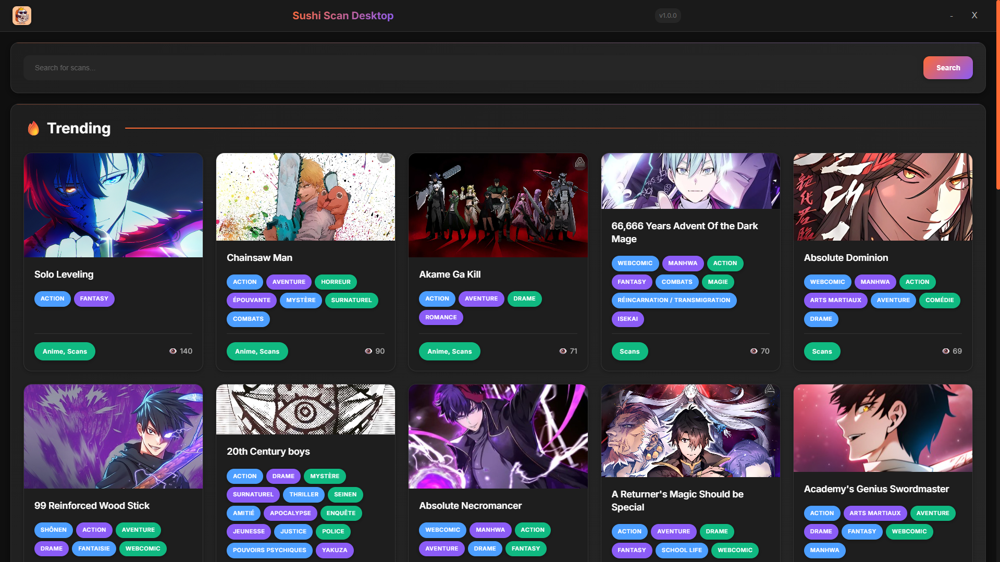

# 🍣 SushiScan

<div align="center">


**Un lecteur de manga moderne et multiplateforme avec une belle interface sombre**

[](https://github.com/saumondeluxe)
[](https://opensource.org/licenses/MIT)
[](https://electronjs.org/)
[](https://capacitorjs.com/)
[](https://developer.mozilla.org/en-US/docs/Web/JavaScript)

[📱 Télécharger APK](#-installation) • [🖥️ App Bureau](#-installation) • [🚀 Fonctionnalités](#-fonctionnalités) • [📖 Documentation](#-documentation)



*Découvrez la lecture de manga comme jamais auparavant avec notre interface élégante et moderne*

</div>

## ✨ Fonctionnalités

### 🎨 **Interface Moderne Sombre**
- **Thème Sombre Élégant** avec des accents orange/bleu/violet
- **Design Responsive** optimisé pour toutes les tailles d'écran
- **Animations Fluides** et effets de survol
- **Intégration Google Fonts** (Inter) pour une typographie nette

### 📚 **Découverte Intelligente de Manga**
- **Catégories Page d'Accueil** : Tendances, Populaires et Recommandés
- **Recherche en Temps Réel** avec debounce de 300ms pour des résultats instantanés
- **Cartes Dynamiques** avec images de couverture, genres et indicateurs de popularité
- **Pages Détaillées de Manga** avec métadonnées complètes

### 📖 **Lecteur de Chapitres Avancé**
- **Chargement Séquentiel d'Images** optimisé pour les réseaux mobiles
- **Système de Fallback Google Drive à 8 Méthodes** pour une livraison d'images fiable
- **Détection Intelligente de Qualité** avec critères spécifiques aux mangas
- **Suivi de Progression** avec retour visuel
- **Navigation entre Chapitres** avec transitions fluides

### 📱 **Compatibilité Multiplateforme**
- **App Bureau** (Windows, macOS, Linux) via Electron
- **App Mobile** (Android, iOS) via Capacitor
- **Capacités Progressive Web App**
- **Lecture Hors Ligne** (bientôt disponible)

### ⚡ **Optimisée pour les Performances**
- **Approche Mobile-First** avec stratégies de chargement optimisées
- **Gestion Intelligente des Timeouts** (30s par tentative d'image)
- **Gestion Complète des Erreurs** avec fallbacks automatiques
- **Rendu d'Images Économe en Mémoire**

## 🎯 Démarrage Rapide

### Prérequis
- Node.js 16+ et npm
- Pour Android : Android Studio
- Pour iOS : Xcode (macOS uniquement)

### 🚀 Installation

```bash
# Cloner le dépôt
git clone https://github.com/saumondeluxe/sushiscan-v2.git
cd sushiscan-v2

# Installer les dépendances
npm install

# Démarrer le serveur de développement
npm start
```

### 📱 Développement Mobile

```bash
# Construire et synchroniser pour mobile
npm run build
npm run cap:sync

# Exécuter sur Android
npm run cap:run-android

# Exécuter sur iOS (macOS uniquement)
npm run cap:run-ios

# Construire APK pour distribution
npm run cap:build
```

### 🖥️ Développement Bureau

```bash
# Démarrer l'app Electron
npm start

# Packager pour distribution
npm run package

# Créer les installateurs
npm run make
```

## 🏗️ Structure du Projet

```
SushiScanV2/
├── 📁 src/
│   ├── 📁 public/
│   │   ├── 📄 index.html      # Interface principale de l'app
│   │   ├── 📁 css/
│   │   │   └── 📄 index.css   # Thème sombre & styles responsive
│   │   └── 📁 js/
│   │       └── 📄 index.js    # Logique principale & intégration API
│   ├── 📄 index.js            # Processus principal Electron
│   └── 📄 preload.js          # Script preload Electron
├── 📁 www/                    # Fichiers construits pour Capacitor
├── 📁 android/                # Fichiers plateforme Android
├── 📁 ios/                    # Fichiers plateforme iOS
├── 📄 capacitor.config.json   # Configuration Capacitor
├── 📄 forge.config.js         # Configuration Electron Forge
└── 📄 package.json            # Dépendances & scripts du projet
```

## 🔧 Intégration API

SushiScan s'intègre avec l'**API SaumonDeLuxe** pour les données manga :

### Endpoints Utilisés
- **Page d'Accueil** : `GET /scans/homepage` - Mangas tendances, populaires & recommandés
- **Recherche** : `GET /scans/manga/search?title={query}` - Recherche manga en temps réel
- **Données Chapitre** : `GET /scans/chapter?title={title}&scan_name={scan}&chapter_number={num}`

### Optimisation d'Images
Notre **système de fallback Google Drive à 8 méthodes** avancé assure un chargement d'images fiable :

1. 🎯 **Primaire** : `drive.google.com/thumbnail` (optimisé mobile)
2. 🌐 **CDN** : variantes `lh3.googleusercontent.com`
3. 📥 **Direct** : `drive.google.com/uc?export=download`
4. 🔄 **Legacy** : méthodes classiques d'export Google Drive
5. ⚡ **Rapide** : APIs thumbnail compressées
6. 🎨 **Qualité** : fallbacks haute résolution
7. 📱 **Mobile** : optimisé faible bande passante
8. 🛡️ **Backup** : méthodes de fallback d'urgence

## 🎨 Philosophie de Design

### Palette de Couleurs
```css
/* Thème Sombre Principal */
--bg-primary: #0a0a0a     /* Arrière-plan noir profond */
--bg-secondary: #1a1a1a   /* Arrière-plans des cartes */
--bg-tertiary: #2a2a2a    /* Éléments élevés */

/* Couleurs d'Accent */
--accent-orange: #ff6b35  /* Actions principales */
--accent-blue: #4a9eff    /* Actions secondaires */
--accent-purple: #8b5cf6  /* Mises en évidence spéciales */

/* Couleurs de Texte */
--text-primary: #ffffff   /* Texte principal */
--text-secondary: #b0b0b0 /* Texte secondaire */
--text-muted: #666666     /* Texte atténué */
```

### Typographie
- **Police Principale** : Inter (Google Fonts)
- **Gamme de Poids** : 300-700
- **Optimisée pour** : Lisibilité et esthétique moderne

## 📊 Métriques de Performance

| Fonctionnalité          | Mobile     | Bureau   |
| ----------------------- | ---------- | -------- |
| **Chargement Initial**  | < 3s       | < 1s     |
| **Réponse Recherche**   | < 500ms    | < 200ms  |
| **Chargement Images**   | Séquentiel | Optimisé |
| **Utilisation Mémoire** | < 150MB    | < 200MB  |
| **Efficacité Réseau**   | 90%+       | 95%+     |

## 🛠️ Développement

### Style de Code
- **JavaScript ES6+** avec patterns async/await modernes
- **CSS Vanilla** avec propriétés personnalisées CSS
- **Approche mobile-first** pour le design responsive
- **Stratégie d'amélioration progressive**

### Fonctions Clés
```javascript
// Chargement principal des mangas
loadHomepageCards()      // Contenu dynamique page d'accueil
performSearch(query)     // Recherche temps réel
showMangaDetails(manga)  // Vue détaillée manga
loadChapter(chapter)     // Lecteur de chapitre
loadPagesSequentially()  // Chargement d'images optimisé
```

## 🚀 Déploiement

### Distribution Bureau
```bash
# Créer des packages spécifiques à la plateforme
npm run make

# Sorties :
# Windows : installateur .exe
# macOS : package .dmg  
# Linux : packages .deb/.rpm
```

### Distribution Mobile
```bash
# Construire APK Android
npm run cap:build

# Construire App iOS (macOS uniquement)
npm run cap:build-with-ios
```

## 🤝 Contribuer

Nous accueillons les contributions ! Voici comment commencer :

1. **Forker** le dépôt
2. **Créer** une branche fonctionnalité (`git checkout -b feature/fonctionnalite-geniale`)
3. **Commiter** vos changements (`git commit -m 'Ajouter fonctionnalité géniale'`)
4. **Pousser** vers la branche (`git push origin feature/fonctionnalite-geniale`)
5. **Ouvrir** une Pull Request

### Directives de Développement
- Suivre le style de code existant
- Tester sur mobile et bureau
- Assurer la compatibilité design responsive
- Ajouter des commentaires pour la logique complexe
- Mettre à jour la documentation si nécessaire

## 📝 Licence

Ce projet est sous licence **MIT** - voir le fichier [LICENSE](LICENSE) pour les détails.

## 👨‍💻 Auteur

**SaumonDeLuxe**
- 📧 Email : planque.adam@gmail.com
- 🌐 GitHub : [@saumondeluxe](https://github.com/shadowforce78)

## 🙏 Remerciements

- **Fournisseur API** : API SaumonDeLuxe pour les données manga
- **Inspiration Design** : Applications modernes de lecture de manga
- **Stack Technologique** : Electron, Capacitor et standards web
- **Communauté** : Testeurs bêta et contributeurs de feedback

## 📈 Feuille de Route

### 🔮 Fonctionnalités à Venir
- [ ] **Lecture Hors Ligne** avec stockage local
- [ ] **Historique de Lecture** et signets
- [ ] **Comptes Utilisateurs** et sync entre appareils
- [ ] **Gestionnaire de Téléchargements** pour les chapitres
- [ ] **Statistiques de Lecture** et suivi de progression
- [ ] **Bascule Thème Sombre/Clair**
- [ ] **Support Multilingues**
- [ ] **Filtres de Recherche Avancés**
- [ ] **Moteur de Recommandations** basé sur l'historique
- [ ] **Fonctionnalités Sociales** et avis

### 🎯 Objectifs de Performance
- [ ] Temps de chargement sous 2s sur réseaux 3G
- [ ] Taux de succès chargement images 95%+
- [ ] Utilisation mémoire < 100MB sur mobile
- [ ] Score conformité PWA 90+

---

<div align="center">

**Fait avec 🍣 et ❤️ par SaumonDeLuxe**

*Si ce projet vous aide, pensez à lui donner une ⭐ !*

[](https://github.com/shadowforce78/sushiscanv2)

</div>
